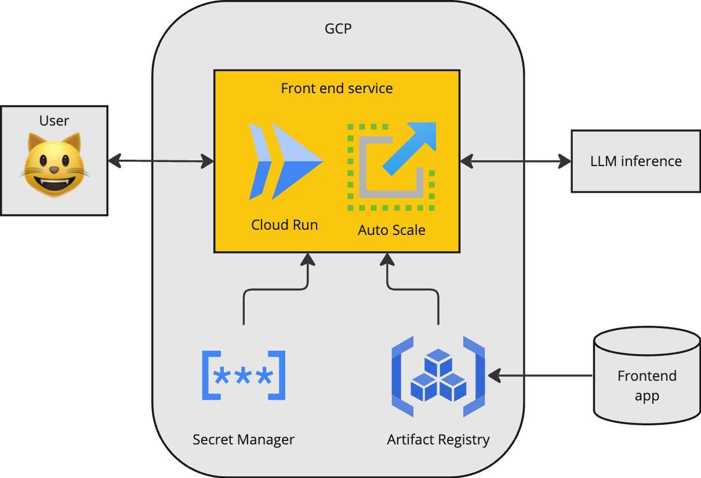

# Twenty Questions Game with LLM

This is a Twenty Questions game where you play against a Language Model (LLM).

## How to Play

1. Start the game.
2. Think of an object.
3. The LLM will ask up to twenty yes/no questions to guess your object.

## Architecture Diagram



## Components

The frontend service is designed using Streamlit and deployed to Google Cloud Run using Terraform and Docker. 

Streamlit is an efficient way to quickly build and deploy front end data applications. It is Python-based which makes its a good choice for Machine Learning Engineers to develop prototype front end applications. 

Google Cloud Run was chosen as it is container based and serverless. This means it can be automatically scaled to make sure there are enough containers available to handle all requests. It does this by using a load balancer to forward requests to available containers, and an autoscaler to add/remove containers as required. 

There are two other serverless Google Cloud compute products that could have been used: Cloud Functions and App Engine. Cloud Functions are typically used for glue code though, and aren't used to serve highly concurrent workloads like web-applications. Therefore it would have been a poor choice for the front end service.

App Engine is a serverless application platform that could have been used. It is source-based rather than container-based meaning it runs inside a standard language-specific runtime. I tend to prefer container based platforms as it provides a better division of responsibilties. The pricing model for Cloud Run is also cheaper than App Engine.

Terraform was chosen for infrastructure as code as it is a standard industry tool and enables reliable and repeatable deployments.

Since an LLM is available via API there was no need to deploy an additional LLM service, which would be costly and complex. In a production system I would closely monitor the proportion of successful API requests sent to the LLM to ensure that users are not overloading the external API, or hitting request rate thresholds. If that was the case then it may be required to deploy the LLM backend as an additional microservice.

Google Secret Manager was used to pass the LLM API key to the front end service as an environment variable, following a standard Google Cloud Run pattern, to ensure that the API key is securely stored.

## Deployment steps

To push the front end container to the Google Artifact Registry:

```bash
$ PROJECT=$(gcloud config get-value project)
$ IMAGE=europe-docker.pkg.dev/$PROJECT/twenty-questions/app
$ docker build . -t $IMAGE -f Dockerfile --platform linux/amd64
$ docker push $IMAGE
```

To deploy using Terraform run: 

```bash
$ terraform init
$ terraform plan --out tfplan
$ terrraform apply tfplan
```